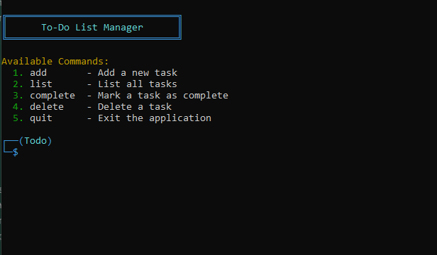

# Python To-Do List Application

A robust and feature-rich command-line to-do list application built with Python, featuring task management with validation, persistent storage, and comprehensive error handling.

## Features

- **Task Management**
  - Create tasks with title, description, and due date
  - Mark tasks as complete
  - Delete tasks
  - View all tasks

- **Data Validation**
  - Title and description must be non-empty
  - Due dates must follow YYYY-MM-DD format
  - Date validation ensures realistic future dates (between last year and 10 years ahead)
  - Prevents empty or whitespace-only inputs

- **Data Persistence**
  - Tasks automatically saved to JSON file
  - Automatic data directory creation
  - Robust error handling for file operations

## Installation Guide

### Prerequisites
- Python 3.7 or higher
- pip (Python package installer)

### Steps
1. Clone the repository:
   ```bash
   git clone https://github.com/MathisDelrue/To-do-list.git
   cd To-do-list
   ```

2. Install required packages:
   ```bash
   pip install -r requirements.txt
   ```

3. Run the application:
   ```bash
   cd src
   python main.py
   ```

### Dependencies
This application uses Python's standard library components only. No additional package installation is required.

### Application Screenshot

*Screenshot of the To-Do List application showing the command-line interface with colored output and task management features.*


